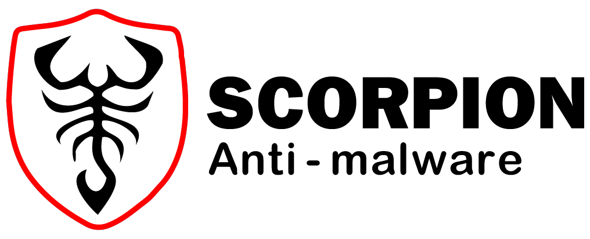
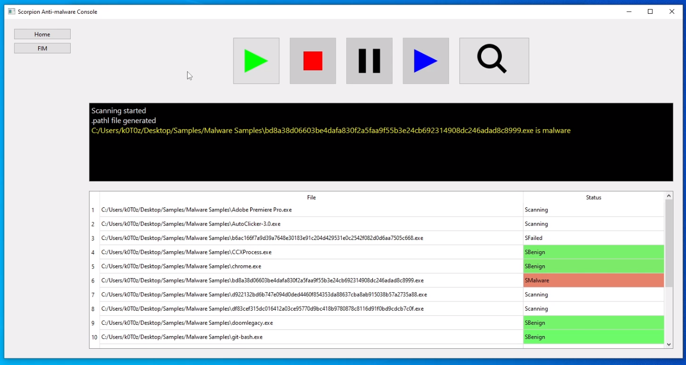
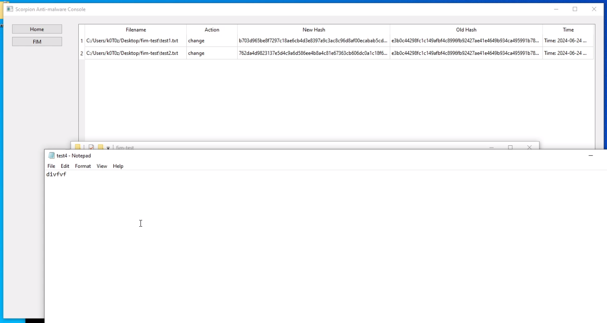

Scorpion Anti-malware's Docs
=============================

Welcome to the official documentation of `Scorpion Anti-malware <https://scorpionantimalware.github.io/scorpion-antimalware-website/>`_, the AI powered 
anti-malware framework!

The table of contents in the sidebar should let you easily access the documentation
for your topic of interest. You can also use the search function in the bottom-left 
corner.

.. Below is the main table-of-content tree of the documentation website.

.. toctree::
   :hidden:
   :maxdepth: 1
   :caption: Datasets
   :name: datasets

   datasets/index

.. toctree::
   :hidden:
   :maxdepth: 1
   :caption: Contributing
   :name: contributing

   contributing/development/index
   contributing/documentation/index

.. toctree::
   :hidden:
   :maxdepth: 1
   :caption: Community
   :name: community

   community/channels

