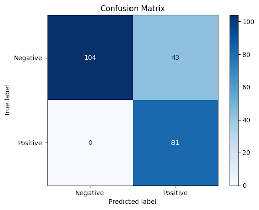

.. _doc_models:

Models
======

Our proposed architecture demonstrates superior performance compared to individual models. We evaluated its efficacy using 130 new zero-day samples obtained from MalwareBazaar, analyzing them through a cloud sandbox employing web scraping techniques. The results were as follows:

 - 81 samples were correctly identified as malware (true positives)
 - 43 samples were incorrectly classified as benign (false positives)
 - 6 samples remained unclassified

Notably, our static analysis pipeline successfully processed some samples that the dynamic model failed to classify.

Furthermore, we observed interesting outcomes in cases where the static and dynamic pipelines yielded different results:

 - 9 samples, vaguely classified as benign by the static pipeline but unclassified by the dynamic model, were ultimately categorized as benign.
 - 7 samples, vaguely classified as malware by the static pipeline but unclassified by the dynamic model, were ultimately categorized as malware.

To assess the system's performance on benign files, we collected 104 new samples from the Windows partition. These were subjected to the same cloud sandbox analysis with web scraping techniques. The results were impressive:

 - All 104 samples were correctly identified as benign (true negatives)
 - No samples were misclassified as malware (zero false negatives)

As with the malware samples, our static analysis pipeline successfully processed some benign samples that the dynamic model failed to classify.

These results underscore the robustness and accuracy of our proposed architecture in identifying both malware and benign files, showcasing its potential for real-world applications in cybersecurity.

We have tested each model on its own on these 130 Malware samples and here is the result:

.. note:: We used an 0.5 boundry in all experiments.

.. list-table:: Zero-day Malware Samples Results
   :widths: 25 25 25 25 50
   :header-rows: 1

   * - Model
     - TPs Count (Out of 130)
     - FPs Count (Out of 130)
     - Failed (Out of 130)
     - Full Architecture Performance Increase (TPs / FPs)

   * - Static DNN
     - 87
     - 37
     - 6
     - .. raw:: html

   -7.41% / -13.95%

   * - Static CNN
     - 79
     - 51
     - 0
     - .. raw:: html

   +2.47% / +18.6%

   * - Dynamic CNN BiGRU
     - 35
     - 89
     - 6
     - .. raw:: html

   +56.79% / +106.98%

.. list-table:: Benign Samples Results
   :widths: 25 25 25 50
   :header-rows: 1

   * - Model
     - TPs Count (Out of 104)
     - FPs Count (Out of 104)
     - Full Architecture Performance Increase (TPs / FPs)

   * - Static DNN
     - 102
     - 2
     - .. raw:: html

   +1.92% / -

   * - Static CNN
     - 79
     - 25
     - .. raw:: html

   +24.04% / -

   * - Dynamic CNN BiGRU
     - 104
     - 0
     - - / -

Note that if you want to check these results, here are our samples with reports: `Malware samples <https://drive.google.com/file/d/1Nq3FP96aROv-m3Qzy91LKcfcNkK5weAd/view?usp=drive_link>`_ and `Benign samples <https://drive.google.com/file/d/1mSJhi2RgCdOYPFSvTJ_0MADaQw-nij5A/view?usp=drive_link>`_.
